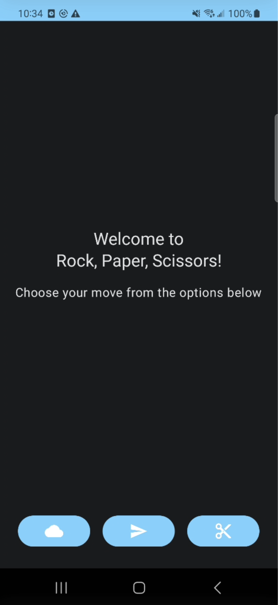
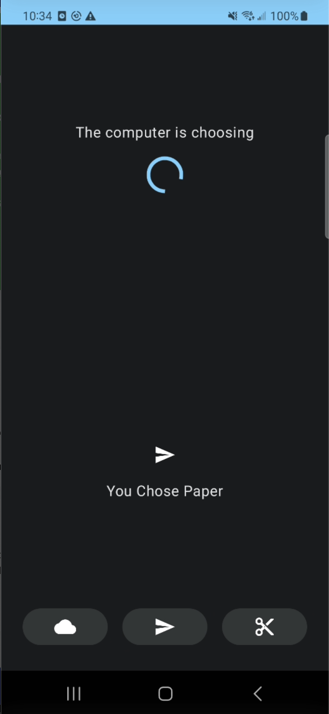
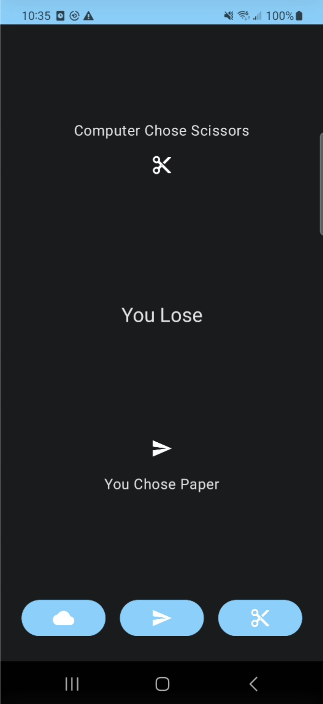
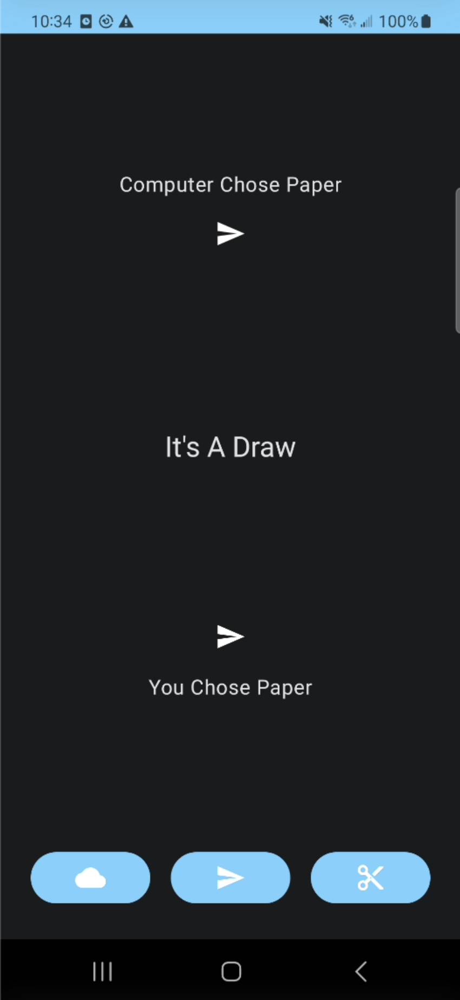
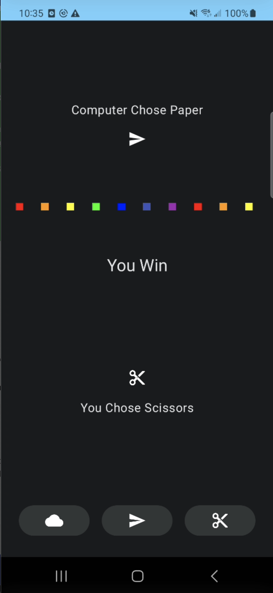

# Rock, Paper, Scissors

This is a very simple Rock, Paper, Scissors game using Jetpack Compose. Just to tool around with it.

## Screenshots

When the app is launched, the user is greeted with a welcome screen. The user is prompted to select from one of the three options: Rock, Paper, or Scissors.

After the user selects an option, the app will display the user's choice and a loading indicator to simulate the computer taking its turn.

After a short delay, the app will display the computer's choice and the result of the game.

If the user wins, the app will show a very basic confetti animation. This can definitely be improved upon, but it's a start.

